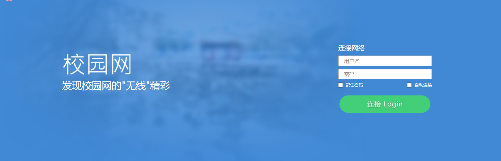

# Introduction
[简体中文(Simple Chinese)](./README.MD) | English
This script implements the login for Ruijie ePortal Web authentication. It requires the support of the curl command and uses curl to send the necessary POST data packets for web authentication.

If your school also uses Ruijie for campus network authentication and has enabled the Web authentication method (as shown in the image below), you should be able to use this script for authentication.



The script files in the project that are named with the suffix **_jmu** are only applicable to Jimei University. For other schools, please use the script files named with the suffix **_general**.

Feel free to submit a Pull request to contribute authentication scripts for your own school!

**The script depends on curl, so make sure curl is installed on your system before using it.**

# Script Workflow

The main workflow of this Shell script is as follows:

1. Send a GET request to the [Captive Portal Server](https://en.wikipedia.org/wiki/Captive_portal) and check if the returned HTTP status code is 204:
   1. If it is 204, it means you are already able to connect to the Internet. The script exits and the subsequent authentication process is stopped.
   2. If it is not 204, it means Ruijie authentication has not been performed yet (generally, when you request any page without authentication, the authentication server will return an HTTP 302 or 301 status code to redirect you to the ePortal authentication page). In this case, the URL of the page to which the HTTP redirect is made is considered the authentication page URL.
2. Construct the HTTP request required for Ruijie ePortal authentication and send it using curl.
3. Authentication success.

# Basic Usage
For shell scripts:

```shell
./ruijie_template.sh username password code
```
For Windows usage:
```cmd
windows_amd64.exe username password code
```

- The `username` parameter is the authentication username.
- The `password` parameter is the authentication password.
- The `code` parameter is the operator password (ignore if not applicable).

# Limitations

In the POST data packet of Ruijie ePortal Web authentication, a `validcode` parameter, which represents a captcha, was found. My school does not require entering a captcha during authentication. However, through testing, it was discovered that if there are multiple authentication failures (e.g., incorrect username or password) or multiple repeated refreshes of the authentication page, the authentication process will require entering the captcha displayed on the page.

If your school requires entering a captcha during the authentication process, this shell script is not suitable for authentication. You would need to implement captcha recognition functionality using scripting languages like Python before proceeding with authentication.

# Afterword

After Ruijie's ePortal Web authentication was launched, when submitting the `userIndex` parameter to the `InterFace.do?method=getOnlineUserInfo` interface via POST, the user's password was displayed in plain text, which seems to have no security at all. (This issue has been fixed after the authentication system upgrade at Jimei University)

In my school, it seems that port 53 (DNS) can communicate normally without authentication. If your school has a similar situation, you may try setting up a proxy on port 53 to achieve Internet access without authentication.