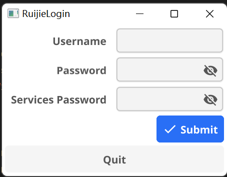

## 项目介绍
本项目脱胎于school_ruijie项目master分支，使用了fyne图形化进行可视化的表达，当前支持全平台。

## 样例图片


## 编译教程

> 本机编译需要go语言环境，请先安装go环境

1. git克隆仓库

```shell
git clone -b fyne https://github.com/theshdowaura/school_ruijie.git
```
2. 切换到项目目录
```shell
cd school_ruijie
```
3. 编译
```shell
go build .
```
